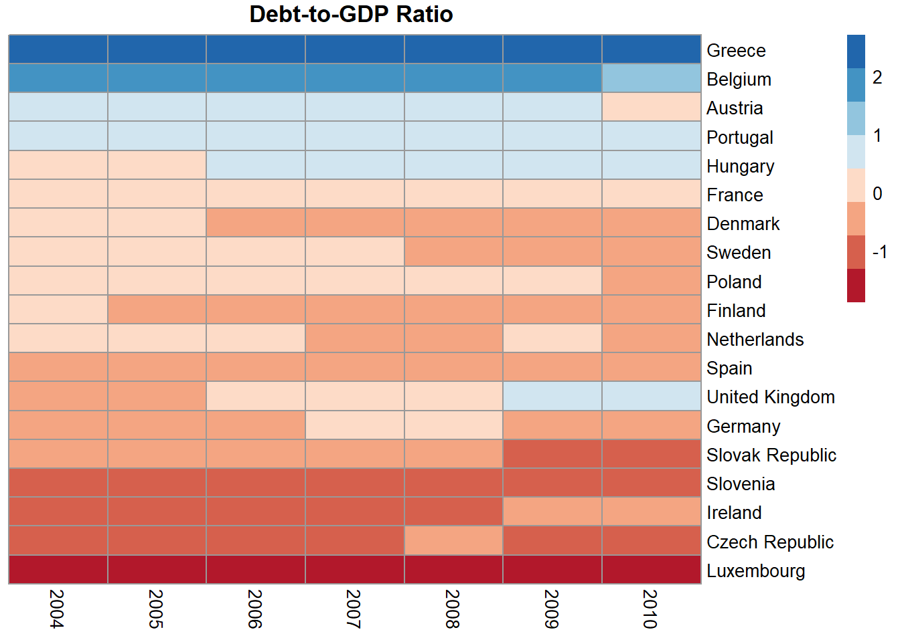

# Dendrogram, Heatmap, Scatterplot in R
This code shows how to build a dendrogram, heatmap and scatterplot.
The data set contains information about the debt to GDP ratio from 2003 to 2010. 
Below you can see an example of the data visualization.

